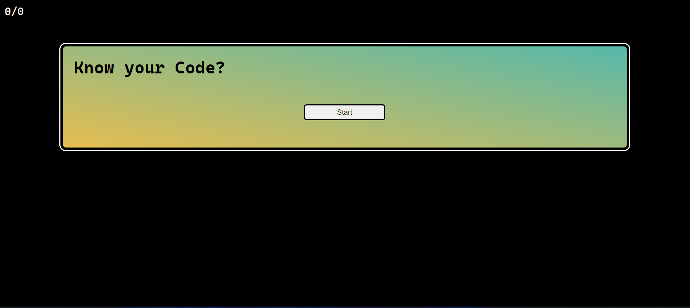

# code-quiz-challenge4
This challenge brought out a lot of critical thinking skills, and helped me grasp how something more complex is designed. It excites me to move forward, dive deeper and work on something even more complex.

I understand it is not the craziest ordeal but it was very satisying being able to put it together. I learned how to utilize objects, more specifically nesting objects into an array so that you can easily flip through the content that you need.

This challenge also helped me utilize functions more and organize the different moving parts on the page, where it became easy to take things step-by-step.

Overall, I think my skills are getting better and better with each assignment. 

 https://jalenarms1.github.io/code-quiz-challenge4/

